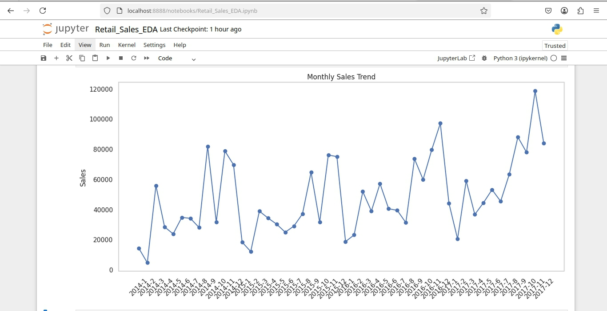
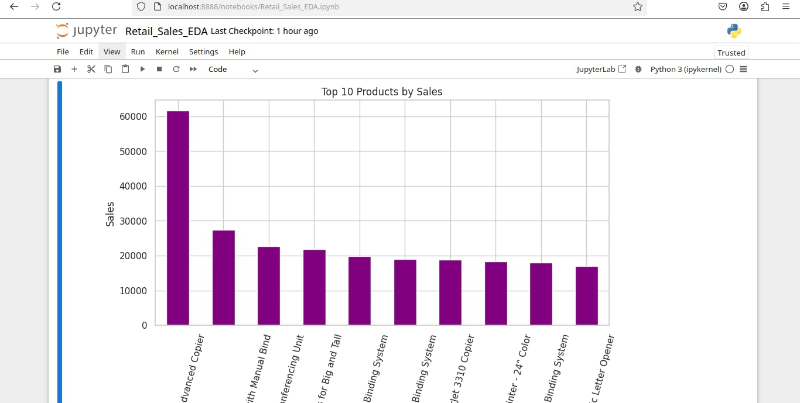

# 📊 Retail Sales Analysis & Forecasting Dashboard

This is a real-world data analysis project that explores sales, profit, and performance trends from a sample Superstore dataset. It simulates work I would do for a business client to help them make smarter decisions.

## 🔍 Objective
- Understand sales trends over time
- Identify profitable and unprofitable products
- Analyze customer behavior and regional performance
- Recommend actions based on insights (Recommendations.mkd)

## 📁 Files
All raw data sourced from Kaggle
- `Retail_Sales_EDA.ipynb`: Jupyter notebook with data cleaning, EDA, and visualizations
- `data/SampleSuperstore.csv`: Raw dataset used
- `images/`: Contains exported charts used on LinkedIn
- `Recomendation.mkd`: My summarized findings and recommendations
- `requirements.txt`: Python libraries to run the code

## 📈 Sample Charts

## 🧠 Key Insights
- Office Supplies category had the highest orders but low profits
- Q4 (Nov-Dec) is peak sales season, especially for Technlogy
- Western region has the strongest profit performance

## 💼 Tools Used
- Python (Pandas, Matplotlib, Seaborn, Plotly)
- Jupyter Notebook
- Excel, Power BI was used, but I didn't show the data visualization with it, I displayed it with Jupyter
- GitHub for version control

## 👤 About Me
I'm Obed, a Data Analyst (aslo an Android Developer - KMP) skilled in Python and Excel. I created this project to showcase my ability to turn messy data into insights that drive action.

> 📬 Contact me on [LinkedIn](https://www.linkedin.com/in/obed-ojingwa-94a73422a/) or [GitHub](https://github.com/Obed-Ojingwa) or [Whatsapp](https://wa.me/+2348102544186)
